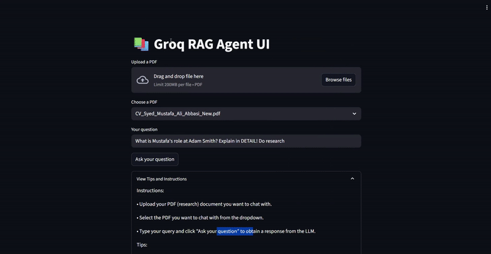
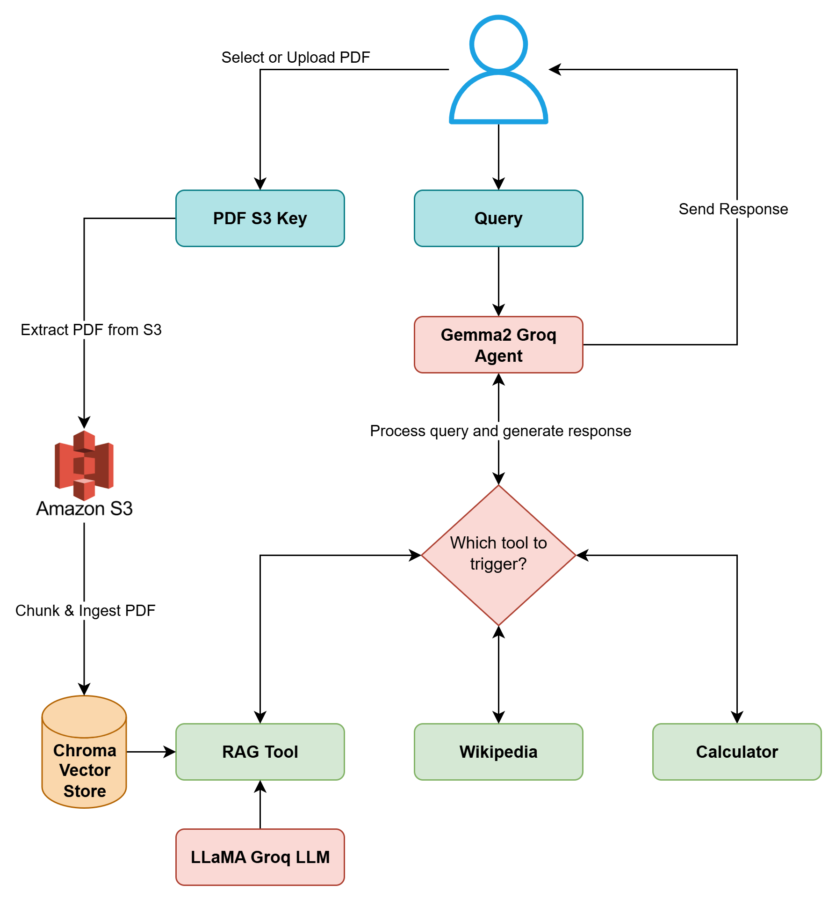
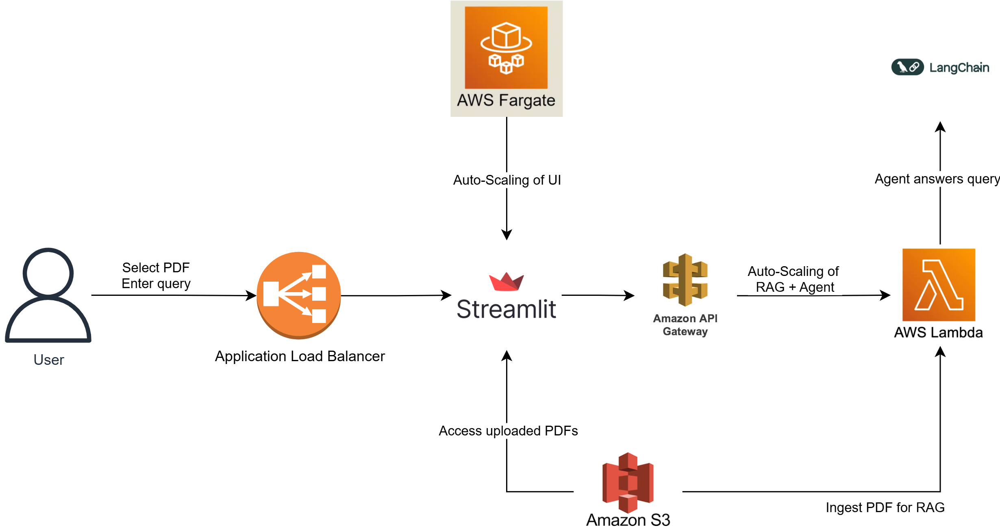

# Groq RAG Agent in Langchain

## Description
A streamlit app deployed using AWSm allowing users to chat with their own PDF documents and interact with other tools using a ReACT agent created with Langchain and [Groq](https://groq.com/).

The model currently has access to the following tools:
- Wikipedia
- Calculator
- Research (allows you to query your own PDF)

## ⚡ Quick Demo (GIF)

## 🎥 Full Walkthrough

[Watch on YouTube](https://youtu.be/fy3xkXskUXU)

## How it works

### Agent
- When the user submits a query, the underlying `Gemma2-9b-it` LLM agent decides which tool to use to generate a response.
- The LLM decides which tool to use and invokes the tool with the correct arguments.
- The output of this tool is fed back into the LLM which helps it return it's final answer to the user.
- Note: I am using a `react-json` agent instead of a `react-only` agent with custom prompt engineering to guide the LLM to output JSON.

### Retrieval Augmented Generation (RAG)
- If the LLM decides to use the Research tool, it will end up invoking the custom RAG chain created on top of the original PDF document uploaded by the user or selected from AWS S3.
- The custom RAG chain uses `PDFMiner` to load the documents, a splitter to split documents into chunks, a Huggingface `BGE` model to embed those chunks, and a `Chroma` retriever. 
- I am currently using the `llama-3.1-8b-instant` LLM from `Groq` to answer the user query using the retrieved context.

## Deployment

The UI and Agent are deployed as isolated microservices, allowing both to be scaled indepedently of each other.

### RAG + Agent
- The underlying agent and RAG chain is wrapped in a lambda handler which is then dockerized as a container.
- The container is built and pushed to [Amazon Elastic Container Registry (ECR)](https://aws.amazon.com/ecr/)
- The container is then deployed via [AWS Lambda](https://aws.amazon.com/lambda/) which allows serverless auto-scaling according to the load.
- The AWS Lambda function is exposed through an [API Gateway](https://aws.amazon.com/api-gateway/) endpoint so the UI can access it later.

### Streamlit Frontend
- The streamlit UI is dockerized, built, and pushed to ECR.
- The streamlit container is then deployed via [Amazon Elastic Container Service (ECS)](https://aws.amazon.com/ecs/) + [Amazon Fargate](https://aws.amazon.com/fargate/) configured with auto-scaling as well.
- An application load balancer (ALB) is also introduced to distribute traffic evenly amongst the Fargate tasks.
- This allows the UI to scale to 1000s of users.

### PDF Storage
- [Amazon S3 Object Storage](https://aws.amazon.com/s3/) is used to store the uploaded PDFs.
- The deployed Lambda function downloads and ingests PDFs from S3 as well.

## Limitations and Future Improvements
- The app does not allow for a sustained conversation with memory currently.
- Ideally, a managed vector store like Pinecone, Weaviate, Qdrant, etc should be used instead of ChromaDB.
- AWS Lambda is not ideal for high-throughput, high-memory tasks so the Agent should eventually be deployed via ECS + Fargate or AWS App Runner instead.
- Currently, the UI shows - to each user - all PDFs uploaded to a single S3 bucket. In practice, there should be a layer of user authentication and authorization (via [AWS Cognito](https://aws.amazon.com/cognito/) perhaps?) and each user should only be able to access their own uploaded PDFs.
- In a production setting, responses to hot, repetitive queries should be cached using Redis or Elasticache.
  
